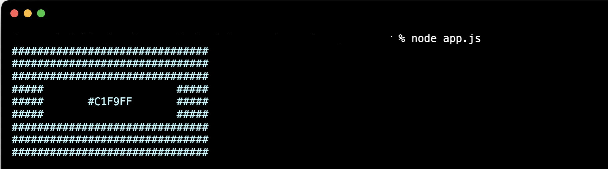

# Random Color Generator

### Logs a color in hex code surrounded by hashtags in the respective color to the console.

This random color generator can do several things:

- If you just enter node index.js, it will return return the block in a random color.
- If you provide a value for color (e.g. red) as the third argument, you will get the block in the respective hue.
- If you additionally provide a value for luminosity (either light or dark) as the fourth argument besides the color value, you will get the block in a either lighter or darker version of the respecitve color.
- If you write 'ask' as the third argument, the console will ask you to add values for color and luminosity manually.
